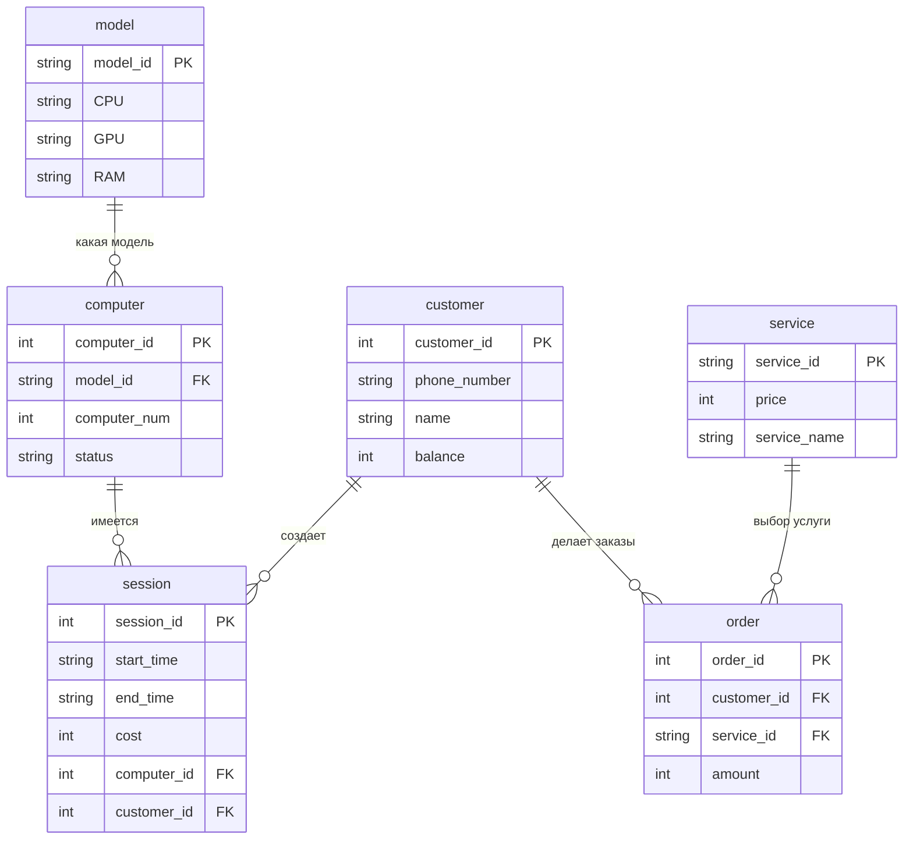
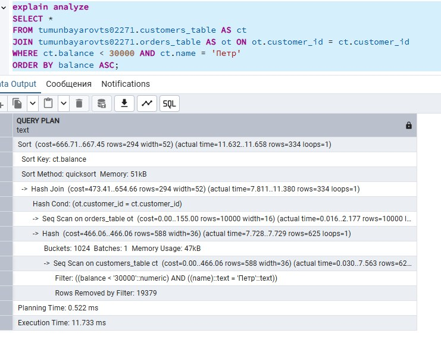
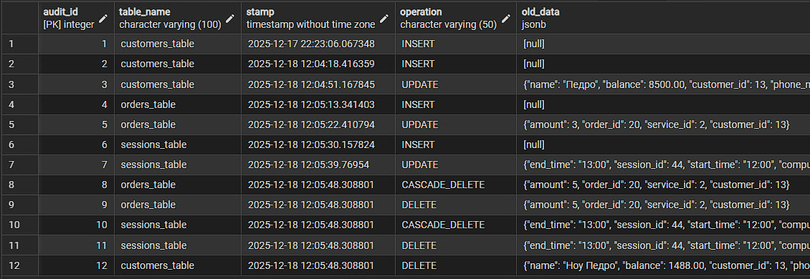

**Лабораторные работы по дисциплине "Базы данных"**

Тумунбаяров Цыбен гр. 02271-ДБ

Telegram [@fnsyqu]

## Постановка задачи:

**Компьютерный клуб (этой работы нет в [перечне задач](https://edu.irnok.net/lib/exe/fetch.php?media=db:%D0%B2%D0%B0%D1%80%D0%B8%D0%B0%D0%BD%D1%82%D1%8B_%D0%B7%D0%B0%D0%B4%D0%B0%D0%BD%D0%B8%D0%B9_%D0%BF%D0%BE_%D1%83%D0%B4.pdf))**


*Сущности*:  
Клиенты(ID, Номер телефона, имя)  
Компьютеры(ID, модель, номер компьтера, статус)  
Модели компьютеров(ID, CPU, GPU, RAM)  
Сеансы(ID,время начала, время окончания, цена за час, ID компьютера, ID клиента)  
Заказ услуг(ID, ID клиента, ID услуги, количество)  
Услуги(ID, цена, название услуги)

*Процессы:*  
Оформление клиентов игровых сеансов, получение услуг (еда, напитики и пр.).  
В информацию о сеансе входит номер выбранного компьютера, его модель, статус на данный момент.

*Выходные документы:*

Вывести информацию о сессиях: ID клиента, модели и компьютера, время сеанса и отсортированную по убыванию суммарной стоимости сеанса

## Лабораторная работа 1. Проектирование логической и физической модели БД

### ER-диаграмма



## Проверка нормальных форм

### **Первая нормальная форма (1NF):**
✅ **Соблюдена.** Все таблицы удовлетворяют требованиям 1NF:
- Каждая таблица имеет первичный ключ
- Все значения атомарны (не содержат составных или множественных значений)
- В каждой таблице нет повторяющихся групп данных
- Порядок строк не имеет значения

### **Вторая нормальная форма (2NF):**
✅ **Соблюдена.** Все таблицы находятся во 2NF:
- Все таблицы уже находятся в 1NF
- В таблицах с составными первичными ключами все неключевые атрибуты полностью зависят от всего составного ключа
- В таблицах с простыми первичными ключами неключевые атрибуты зависят от всего ключа
- Частичных зависимостей не обнаружено

### **Третья нормальная форма (3NF):**
✅ **Соблюдена.** Все таблицы соответствуют требованиям 3NF:
- Все таблицы уже находятся во 2NF
- Транзитивные зависимости между неключевыми атрибутами отсутствуют
- Все неключевые атрибуты зависят непосредственно от первичного ключа
- В таблице `model` атрибуты CPU, GPU, RAM зависят только от model_id
- В таблице `service` цена услуги зависит только от service_id

## Лабораторная работа 2. Создание и наполнение таблиц 
*Создание таблиц*

```sql
-- Таблица 'customers' (Клиенты)
CREATE TABLE tumunbayarovts02271.customers (
    customer_id SERIAL PRIMARY KEY,
    phone_number VARCHAR(255) NOT NULL,
    name VARCHAR(255) NOT NULL,
    balance INTEGER NOT NULL DEFAULT 0 CHECK (balance >= 0)
);

-- Таблица 'model' (Модели компьютеров)
CREATE TABLE tumunbayarovts02271.model (
    model_id INTEGER PRIMARY KEY,
    CPU VARCHAR(255) NOT NULL,
    GPU VARCHAR(255) NOT NULL,
    RAM VARCHAR(255) NOT NULL
);

-- Таблица 'computers' (Компьютеры)
CREATE TABLE tumunbayarovts02271.computers (
    computer_id SERIAL PRIMARY KEY,
    model_id INTEGER NOT NULL REFERENCES tumunbayarovts02271.model(model_id),
    computer_num INTEGER NOT NULL CHECK (computer_num > 0),
    status VARCHAR(255) NOT NULL DEFAULT 'свободен' 
        CHECK (status IN ('свободен', 'занят', 'неисправен'))
);

-- Таблица 'service' (Дополнительные услуги)
CREATE TABLE tumunbayarovts02271.service (
    service_id VARCHAR(255) PRIMARY KEY,
    price INTEGER NOT NULL CHECK (price >= 0),
    service_name VARCHAR(255) NOT NULL
);

-- Таблица 'session' (Игровые сессии)
CREATE TABLE tumunbayarovts02271.session (
    session_id SERIAL PRIMARY KEY,
    start_time VARCHAR(255) NOT NULL,
    end_time VARCHAR(255) NOT NULL,
    cost INTEGER NOT NULL CHECK (cost >= 0),
    computer_id INTEGER NOT NULL REFERENCES tumunbayarovts02271.computers(computer_id),
    customer_id INTEGER NOT NULL REFERENCES tumunbayarovts02271.customers(customer_id)
);

-- Таблица 'order' (Заказы услуг)
CREATE TABLE tumunbayarovts02271.order (
    order_id SERIAL PRIMARY KEY,
    customer_id INTEGER NOT NULL REFERENCES tumunbayarovts02271.customers(customer_id),
    service_id VARCHAR(255) NOT NULL REFERENCES tumunbayarovts02271.service(service_id),
    amount INTEGER NOT NULL CHECK (amount > 0)
);
```
```sql
-- Заполняем таблицу 'customers'
INSERT INTO tumunbayarovts02271.customers (phone_number, name, balance) VALUES
('+7(900)123-45-67', 'Иван Петров', 5000),
('+7(900)765-43-21', 'Мария Сидорова', 12000),
('+7(901)111-22-33', 'Алексей Кузнецов', 3000),
('+7(902)222-33-44', 'Елена Смирнова', 8000);

-- Заполняем таблицу 'model'
INSERT INTO tumunbayarovts02271.model (model_id, CPU, GPU, RAM) VALUES
(1, 'Intel Core i9-13900K', 'NVIDIA RTX 4090', '32GB DDR5'),
(2, 'AMD Ryzen 9 7950X', 'NVIDIA RTX 4080', '32GB DDR5'),
(3, 'Intel Core i7-13700K', 'NVIDIA RTX 4070 Ti', '16GB DDR5'),
(4, 'AMD Ryzen 7 7800X3D', 'NVIDIA RTX 4060', '16GB DDR5');

-- Заполняем таблицу 'computers'
INSERT INTO tumunbayarovts02271.computers (model_id, computer_num, status) VALUES
(1, 1, 'свободен'),
(1, 2, 'занят'),
(2, 3, 'неисправен'),
(3, 4, 'занят'),
(4, 5, 'свободен'),
(2, 6, 'занят');

-- Заполняем таблицу 'service'
INSERT INTO tumunbayarovts02271.service (service_id, price, service_name) VALUES
('snack', 300, 'Снеки и напитки'),
('support', 500, 'Техническая поддержка'),
('training', 1000, 'Обучение играм'),
('vr', 1500, 'Виртуальная реальность'),
('print', 50, 'Печать документов');

-- Заполняем таблицу 'session'
INSERT INTO tumunbayarovts02271.session (start_time, end_time, cost, computer_id, customer_id) VALUES
('2024-01-15 14:00:00', '2024-01-15 16:30:00', 1500, 2, 1),
('2024-01-15 18:00:00', '2024-01-15 20:00:00', 1200, 4, 2),
('2024-01-16 12:00:00', '2024-01-16 15:00:00', 1800, 6, 3),
('2024-01-16 16:00:00', '2024-01-16 17:00:00', 600, 1, 4),
('2024-01-17 19:00:00', '2024-01-17 22:00:00', 2100, 2, 1);

-- Заполняем таблицу 'order'
INSERT INTO tumunbayarovts02271."order" (customer_id, service_id, amount) VALUES
(1, 'snack', 2),
(1, 'support', 1),
(2, 'training', 1),
(3, 'vr', 2),
(4, 'print', 5),
(2, 'snack', 3);
```
```sql
SELECT 
    c.name,
    s.session_id,
    s.start_time,
    s.end_time,
    s.cost,
    comp.computer_num,
    serv.service_name,
    o.amount,
    serv.price,
    (o.amount * serv.price) AS total_sum
FROM tumunbayarovts02271.customers c
LEFT JOIN tumunbayarovts02271.session s ON c.customer_id = s.customer_id
LEFT JOIN tumunbayarovts02271."order" o ON c.customer_id = o.customer_id
LEFT JOIN tumunbayarovts02271.computers comp ON s.computer_id = comp.computer_id
LEFT JOIN tumunbayarovts02271.service serv ON o.service_id = serv.service_id
ORDER BY c.customer_id, s.session_id, o.order_id;
```

## Лабораторная работа 3. Представления и процедуры
*Цель*: Освоение механизмов абстракции данных и программных модулей.

📋 Задачи:

1. Создание представлений для выходных документов
2. Разработка хранимых процедур с параметрами
3. Представление сложных запросов при помощи представления

### Создание представлений для выходных документов
Вывести информацию о сессиях: ID клиента, модели и компьютера, время сеанса и отсортированную по убыванию суммарной стоимости сеанса
```sql
CREATE OR REPLACE VIEW tumunbayarovts02271.sessions_info
 AS
 SELECT st.session_id,
    cust_t.name,
    st.computer_id,
    ct.model_id,
    abs(st.end_time::double precision - st.start_time::double precision) AS session_time,
    st.cost_per_hour,
    st.cost_per_hour::double precision * abs(st.end_time::double precision - st.start_time::double precision) AS session_cost
   FROM tumunbayarovts02271.sessions_table st
     JOIN tumunbayarovts02271.customers_table cust_t ON st.customer_id = cust_t.customer_id
     JOIN tumunbayarovts02271.computers_table ct ON st.computer_id = ct.computer_id
  ORDER BY (st.cost_per_hour::double precision * abs(st.end_time::double precision - st.start_time::double precision)) DESC;

ALTER TABLE tumunbayarovts02271.sessions_info
    OWNER TO student;
```
### Создание процедур  
Добавление нового клиента:
```sql
CREATE OR REPLACE PROCEDURE public.add_new_customer(
	IN id integer,
	IN n_name character varying,
	IN n_phone_number character varying)
LANGUAGE 'plpgsql'
AS $BODY$
BEGIN

INSERT INTO tumunbayarovts02271.customers_table(customer_id,name,phone_number,balance)

VALUES
 	(id,n_name,n_phone_number,0);

END;
$BODY$;
ALTER PROCEDURE public.add_new_customer(integer, character varying, character varying)
    OWNER TO student;
```
Обновление данных клиента:
```sql
CREATE OR REPLACE PROCEDURE public.update_customer_info(
	IN id integer,
	IN new_name character varying,
	IN new_phone_number character varying)
LANGUAGE 'plpgsql'
AS $BODY$
BEGIN
 	UPDATE tumunbayarovts02271.customers_table
   	SET 
      		phone_number = new_phone_number,
      		name = new_name,
		balance = 0
  	WHERE customer_id = id;
END;
$BODY$;
ALTER PROCEDURE public.update_customer_info(integer, character varying, character varying)
    OWNER TO student;
```
Запросы к представлениям:

```sql
-- Простой запрос для просмотра всех данных представления
SELECT * FROM tumunbayarovts02271.sessions_info;

-- Запрос с фильтрацией по определенным условиям
SELECT 
    session_id,
    name AS "Имя клиента",
    computer_id AS "ID компьютера",
    model_id AS "Модель",
    session_time AS "Время сессии (часы)",
    cost_per_hour AS "Стоимость в час",
    session_cost AS "Общая стоимость"
FROM tumunbayarovts02271.sessions_info
WHERE session_cost > 1000
ORDER BY name, session_id;

-- Запрос для получения статистики по клиентам
SELECT 
    name AS "Имя клиента",
    COUNT(*) AS "Количество сессий",
    SUM(session_time) AS "Общее время (часы)",
    SUM(session_cost) AS "Общая сумма"
FROM tumunbayarovts02271.sessions_info
GROUP BY name
ORDER BY SUM(session_cost) DESC;

-- Запрос для получения статистики по компьютерам
SELECT 
    computer_id AS "ID компьютера",
    model_id AS "Модель",
    COUNT(*) AS "Количество сессий",
    SUM(session_time) AS "Общее время работы (часы)",
    SUM(session_cost) AS "Общий доход"
FROM tumunbayarovts02271.sessions_info
GROUP BY computer_id, model_id
ORDER BY SUM(session_cost) DESC;

-- Запрос с ограничением количества строк
SELECT * FROM tumunbayarovts02271.sessions_info
LIMIT 10;

-- Запрос для поиска самых дорогих сессий
SELECT 
    name AS "Клиент",
    session_time AS "Длительность (часы)",
    session_cost AS "Стоимость"
FROM tumunbayarovts02271.sessions_info
ORDER BY session_cost DESC
LIMIT 5;

-- Запрос с JOIN других таблиц (если нужно больше информации)
SELECT 
    si.*,
    ct.computer_num AS "Номер компьютера",
    ct.status AS "Статус компьютера"
FROM tumunbayarovts02271.sessions_info si
JOIN tumunbayarovts02271.computers_table ct ON si.computer_id = ct.computer_id;
```

## Лабораторная работа 4. Анализ производительности

Цель: Освоение методов анализа и оптимизации производительности БД.

📋 Задачи:

1. Создание генератора данных (20 000 записей в каждой таблице)
2. Анализ планов выполнения запросов (EXPLAIN ANALYZE)
3. Оптимизация БД через индексы и настройки
4. Сравнение производительности до/после оптимизации

### Создание генератора данных (20 000 записей в каждой таблице)

Генератор для таблицы клиентов:
```sql
CREATE OR REPLACE FUNCTION tumunbayarovts02271.generate_random_customers(
    p_count INTEGER DEFAULT 20000,
    p_start_id INTEGER DEFAULT 1
)
RETURNS VOID AS $$
BEGIN
    INSERT INTO tumunbayarovts02271.customers_table (customer_id, name, phone_number, balance)
    SELECT
        p_start_id + i - 1 AS customer_id,
        (ARRAY['Иван', 'Петр', 'Сергей', 'Алексей', 'Дмитрий', 'Андрей', 'Михаил', 'Владимир', 'Константин', 'Евгений','Анна','Зинаида'])[floor(random() * 12) + 1] AS name,
        '8' || LPAD(floor(random() * 10000000000)::text, 10, '0') AS phone_number,
        floor(random()*100000)::numeric as balance
    FROM
        generate_series(1, p_count) AS t(i);
END;
$$ LANGUAGE plpgsql;
```
Генератор для таблицы заказов:

```sql
-- Генератор случайных заказов с использованием generate_series
CREATE OR REPLACE FUNCTION tumunbayarovts02271.generate_random_orders(
    p_count INTEGER DEFAULT 10000,
    p_start_id INTEGER DEFAULT 1
)
RETURNS VOID AS $$
BEGIN
    INSERT INTO tumunbayarovts02271.order (order_id, customer_id, service_id, amount)
    SELECT
        p_start_id + i - 1 AS order_id,
        -- Случайный customer_id от 1 до 20000
        floor(random() * 20000)::integer + 1 AS customer_id,
        -- Случайный service_id из фиксированного списка
        (ARRAY['snack', 'support', 'training', 'vr', 'print'])[floor(random() * 5) + 1] AS service_id,
        -- Случайное количество от 1 до 10
        floor(random() * 10)::integer + 1 AS amount
    FROM
        generate_series(1, p_count) AS t(i);
END;
$$ LANGUAGE plpgsql;
```
### Анализ плана выполения:

```sql
EXPLAIN ANALYZE
SELECT *
FROM tumunbayarovts02271.customers_table AS ct
JOIN tumunbayarovts02271.orders_table AS ot ON ot.customer_id = ct.customer_id
WHERE ct.balance < 30000 AND ct.name = 'Петр'
ORDER BY balance ASC;
```

### Создание индексов:

```sql
-- Создание индекса на столбец баланса
CREATE INDEX balance_idx ON tumunbayarovts02271.customers_table(balance);

-- Создание индекса на столбец имен
CREATE INDEX name_idx ON tumunbayarovts02271.customers_table(name);
```

### Сравнение производительности до и после добавления индексов:

До добавления индексов: 11.773 ms



После добавления индексов: 3.737 ms


Добавление индексов значительно уменьшило время выполнения запроса.

## Лабораторная работа 5. Триггеры и аудит

*Цель*: Реализация бизнес-логики на уровне БД и системы аудита.

📋 Задачи:

1. Триггеры каскадного удаления для связей “один-ко-многим”
2. Триггеры аудита изменений (INSERT, UPDATE, DELETE)
3. Создание таблицы-журнала для отслеживания изменений

### Триггеры каскадного удаления для связей “один-ко-многим”

Удаление заказов клиента:

```sql
CREATE OR REPLACE FUNCTION tumunbayarovts02271.cascade_delete_customer_orders()
    RETURNS trigger
    LANGUAGE 'plpgsql'
    COST 100
    VOLATILE NOT LEAKPROOF
AS $BODY$
BEGIN
    INSERT INTO tumunbayarovts02271.audit_log (
        table_name, stamp, operation, old_data, new_data
    )
    SELECT 
        'orders_table', CURRENT_TIMESTAMP, 'CASCADE_DELETE', row_to_json(o), NULL
    FROM tumunbayarovts02271.orders_table o
    WHERE o.customer_id = OLD.customer_id;
    
    DELETE FROM tumunbayarovts02271.orders_table 
    WHERE customer_id = OLD.customer_id;
    RETURN OLD;
END;
$BODY$;

ALTER FUNCTION tumunbayarovts02271.cascade_delete_customer_orders()
    OWNER TO student;
```

Удаление сессий клиента:

```sql
CREATE OR REPLACE FUNCTION tumunbayarovts02271.cascade_delete_customer_sessions()
    RETURNS trigger
    LANGUAGE 'plpgsql'
    COST 100
    VOLATILE NOT LEAKPROOF
AS $BODY$
BEGIN
    INSERT INTO tumunbayarovts02271.audit_log (
        table_name, stamp, operation, old_data, new_data
    )
    SELECT 
        'sessions_table', CURRENT_TIMESTAMP, 'CASCADE_DELETE', row_to_json(s), NULL
    FROM tumunbayarovts02271.sessions_table s
    WHERE s.customer_id = OLD.customer_id;
    
    DELETE FROM tumunbayarovts02271.sessions_table 
    WHERE customer_id = OLD.customer_id;
    RETURN OLD;
END;
$BODY$;

ALTER FUNCTION tumunbayarovts02271.cascade_delete_customer_sessions()
    OWNER TO student;
```

### Триггеры аудита изменений (INSERT, UPDATE, DELETE)

```sql
CREATE OR REPLACE FUNCTION tumunbayarovts02271.audit_trigger_function()
    RETURNS trigger
    LANGUAGE 'plpgsql'
    COST 100
    VOLATILE NOT LEAKPROOF
AS $BODY$
BEGIN
    --INSERT
    IF TG_OP = 'INSERT' THEN
        INSERT INTO tumunbayarovts02271.audit_log (
            table_name, stamp, operation, new_data
        ) VALUES (
            TG_TABLE_NAME, 
            CURRENT_TIMESTAMP, 
            'INSERT', 
            row_to_json(NEW)
        );
        
    --UPDATE
    ELSIF TG_OP = 'UPDATE' THEN
        INSERT INTO tumunbayarovts02271.audit_log (
            table_name, stamp, operation, old_data, new_data
        ) VALUES (
            TG_TABLE_NAME, 
            CURRENT_TIMESTAMP, 
            'UPDATE', 
            row_to_json(OLD), 
            row_to_json(NEW)
        );
        
    -- DELETE
    ELSIF TG_OP = 'DELETE' THEN
        INSERT INTO tumunbayarovts02271.audit_log (
            table_name, stamp, operation, old_data
        ) VALUES (
            TG_TABLE_NAME, 
            CURRENT_TIMESTAMP, 
            'DELETE', 
            row_to_json(OLD)
        );
    END IF;
    
    RETURN COALESCE(NEW, OLD);
END;
$BODY$;

ALTER FUNCTION tumunbayarovts02271.audit_trigger_function()
    OWNER TO student;
```

### Создание таблицы-журнала для отслеживания изменений

```sql
CREATE TABLE IF NOT EXISTS tumunbayarovts02271.audit_log
(
    audit_id integer NOT NULL DEFAULT nextval('tumunbayarovts02271.audit_log_audit_id_seq'::regclass),
    table_name character varying(100) COLLATE pg_catalog."default" NOT NULL,
    stamp timestamp without time zone DEFAULT CURRENT_TIMESTAMP,
    operation character varying(50) COLLATE pg_catalog."default" NOT NULL,
    old_data jsonb,
    new_data jsonb,
    CONSTRAINT audit_log_pkey PRIMARY KEY (audit_id),
    CONSTRAINT audit_log_operation_check CHECK (operation::text = ANY (ARRAY['INSERT'::character varying, 'UPDATE'::character varying, 'DELETE'::character varying, 'CASCADE_DELETE'::character varying]::text[]))
)

TABLESPACE pg_default;

ALTER TABLE IF EXISTS tumunbayarovts02271.audit_log
    OWNER to student;
```

Работает:


